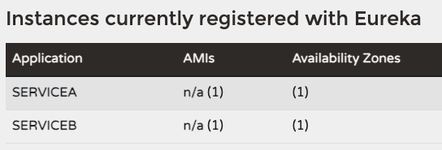

:toc:
:icons: font
:source-highlighter: prettify
:project_id: gs-service-registration-and-discovery
:java_version: 17

This guide walks you through the process of starting and using the Netflix Eureka service
registry.

== What You Will Build

You will set up a https://github.com/spring-cloud/spring-cloud-netflix[Netflix Eureka service registry^], named `eureka-server`, and then build two web clients, named `servicea` and `serviceb`, that both register with the Eureka server.
One of the web clients, `serviceb`, will call the other web client, `servicea`, using `org.springframework.cloud.client.discovery.DiscoveryClient` and https://docs.spring.io/spring-framework/reference/integration/rest-clients.html#rest-restclient[Spring Framework's Rest Client^].

include::https://raw.githubusercontent.com/spring-guides/getting-started-macros/main/guide_introduction.adoc[]

[[scratch]]
== Starting with Spring Initializr

For all Spring applications, you should start with the https://start.spring.io[Spring Initializr^].
The Initializr offers a fast way to pull in all the dependencies you need for an application and does a lot of the set up for you.

This guide needs three applications.
The first application (the server application) needs
only the Eureka Server dependency.
The second and third applications (the client applications) need the Eureka Discovery Client and Spring Web dependencies.

:server-link: https://start.spring.io/#!type=maven-project&language=java&packaging=jar&groupId=com.example&artifactId=eureka-server&name=eureka-server&description=Demo%20project%20for%20Spring%20Boot&packageName=com.example.eureka-server&dependencies=cloud-eureka-server
:clienta-link: https://start.spring.io/#!type=maven-project&language=java&packaging=jar&groupId=com.example&artifactId=servicea&name=servicea&description=Demo%20project%20for%20Spring%20Boot&packageName=com.example.servicea&dependencies=cloud-eureka,web
:clientb-link: https://start.spring.io/#!type=maven-project&language=java&packaging=jar&groupId=com.example&artifactId=serviceb&name=serviceb&description=Demo%20project%20for%20Spring%20Boot&packageName=com.example.serviceb&dependencies=cloud-eureka,web

You can use the following links for pre-initialized projects from Spring Initializr:

- {server-link}[Eureka Server^]
- {clienta-link}[Service A^]
- {clientb-link}[Service B^]

NOTE: Due to the number of services in this guide, only the solutions are provided in the GitHub repository. To start from scratch, generate the blank projects using the links above or using https://start.spring.io[Spring Initializr], as defined below.

To manually initialize the Eureka Server project:

. Navigate to https://start.spring.io.
This service pulls in all the dependencies you need for an application and does most of the setup for you.
. Choose either Gradle or Maven and the language you want to use. This guide assumes that you chose Maven and Java.
. Click *Dependencies* and select *Eureka Server* for the server application.
. Click *Generate*.
. Download the resulting ZIP file, which is an archive of a web application that is configured with your choices.

To manually initialize the Service A and Service B projects:

. Navigate to https://start.spring.io.
This service pulls in all the dependencies you need for an application and does most of the setup for you.
. Choose either Gradle or Maven and the language you want to use. This guide assumes that you chose Maven and Java.
. Select *Eureka Discovery Client* and *Spring Web* for the client applications.
. Click *Generate*.
. Download the resulting ZIP file, which is an archive of a web application that is configured with your choices.


NOTE: If your IDE has the Spring Initializr integration, you can complete this process from your IDE.

[[initial]]
== Start a Eureka Service Registry

You first need a Eureka Server. You can use Spring Cloud's `@EnableEurekaServer`
to stand up a registry with which other applications can communicate. This is a regular
Spring Boot application with one annotation (`@EnableEurekaServer`) added to enable the
service registry. The following listing (from
`eureka-server/src/main/java/com/example/eurekaserver/EurekaServerApplication.java`)
shows the server application:

====
[source,java]
----
include::eureka-server/src/main/java/com/example/eurekaserver/EurekaServerApplication.java[]
----
====

In a production environment, you likely want more than one instance of the registry.
You can find additional information about configuring the Eureka Server https://docs.spring.io/spring-cloud-netflix/reference/spring-cloud-netflix.html#spring-cloud-eureka-server[here^].

By default, the registry also tries to register itself, so you need to disable that
behavior. Additionally, it is a good convention to put this registry on a separate port when using it locally.

Add some properties to `eureka-server/src/main/resources/application.yml` to
handle these requirements, as the following listing shows:

====
[source,yml]
----
include::eureka-server/src/main/resources/application.yml[]
----
====

You can now start the Eureka server by running `./mvnw spring-boot:run`.

== Talking to the Registry

Now that you have started a service registry, you can stand up clients that interact with the registry. Our client applications, ServiceA and ServiceB, automatically register with the Eureka server because we have `spring-cloud-starter-netflix-eureka-client` on the classpath.
To avoid port conflicts, set the `server.port` parameter in both ServiceA and ServiceB:

Service A:
====
[source,yml]
----
include::servicea/src/main/resources/application.yml[]
----
====

Service B:
====
[source,yml]
----
include::serviceb/src/main/resources/application.yml[]
----
====

At this point you, should be able to run all three applications.
You can use the IDE or execute the `./mvnw spring-boot:run` command from each application folder.

When the applications run, you can view the http://localhost:8761/[Eureka dashboard^].



== Service A Endpoint

Create a new class called `com/example/servicea/controller/ServiceARestController.java` in the `servicea` project to expose an endpoint you can use to test the application.

====
[source,java]
----
include::servicea/src/main/java/com/example/servicea/controller/ServiceARestController.java[]
----
====

== Service B Endpoint

Create a new class called `com/example/serviceb/controller/ServiceBRestController.java` in the `serviceb` project to expose an endpoint that calls `servicea`.

====
[source,java]
----
include::serviceb/src/main/java/com/example/serviceb/controller/ServiceBRestController.java[]
----
====

This class uses a `DiscoveryClient` to find the `serviceId` of `servicea` based only on the application name.
This guide has only one instance of `servicea`, so we can look only at the first instance.
This is seen in the following line:

```
ServiceInstance serviceInstance = discoveryClient.getInstances("servicea").get(0);
```

Once you have a `ServiceInstance` that refers to the location of `servicea`, you can now use the information in Spring Framework's https://docs.spring.io/spring-framework/reference/integration/rest-clients.html#rest-restclient[Rest Client].

```

... = restClient.get().uri(serviceInstance.getUri() + "/helloWorld")...

```

You can test all three applications by running the following command:

====
[source,bash]
----
curl http://localhost:8082/serviceB/helloEureka
----
====

And you should see the result:

====
[source,bash]
----
Hello world from Service A!
----
====

== Test the Application

This guide walked through the following steps (which you could do by implementing the code shown throughout this guide or by using the code in the solution repository):

- Run `eureka-server` with the `./mvnw spring-boot:run` command from the `eureka-server` folder
- Run `servicea` with the `./mvnw spring-boot:run` command from the `servicea` folder
- Run `serviceb` with the `./mvnw spring-boot:run` command from the `serviceb` folder
- Observe that `servicea` and `serviceb` are registered by viewing the Eureka Dahsboard at http://localhost:8761/
- Run the `curl http://localhost:8082/serviceB/helloEureka` command to test all three applications are working properly
- Observe the output, `Hello world from Service A!`

NOTE: There is a short delay while `servicea` and `serviceb` register themselves and refresh the instances from the registry. If the `curl` command initially fails, wait a minute and try again.

== Summary
Congratulations! You have just used Spring to stand up a Netflix Eureka service registry
and to use that registry in a client application.

== See Also

The following guides may also be helpful:

* https://spring.io/guides/gs/rest-service/[Building a RESTful Web Service]
* https://spring.io/guides/gs/serving-web-content/[Serving Web Content with Spring MVC]
* https://spring.io/guides/gs/spring-boot/[Building an Application with Spring Boot]

include::https://raw.githubusercontent.com/spring-guides/getting-started-macros/main/footer.adoc[]
